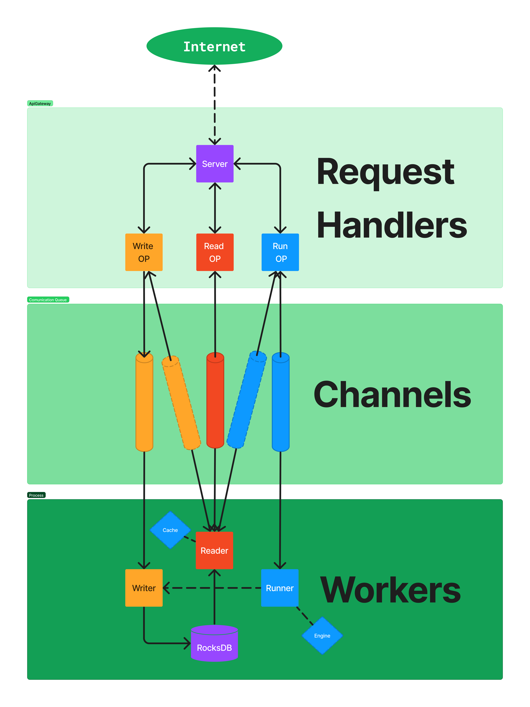
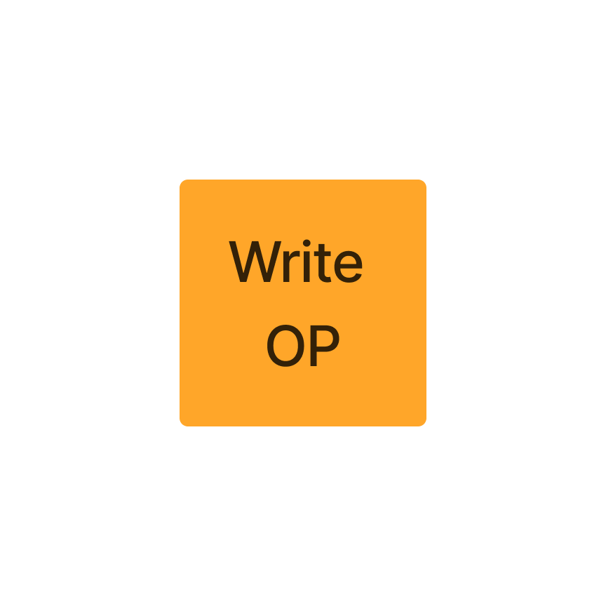
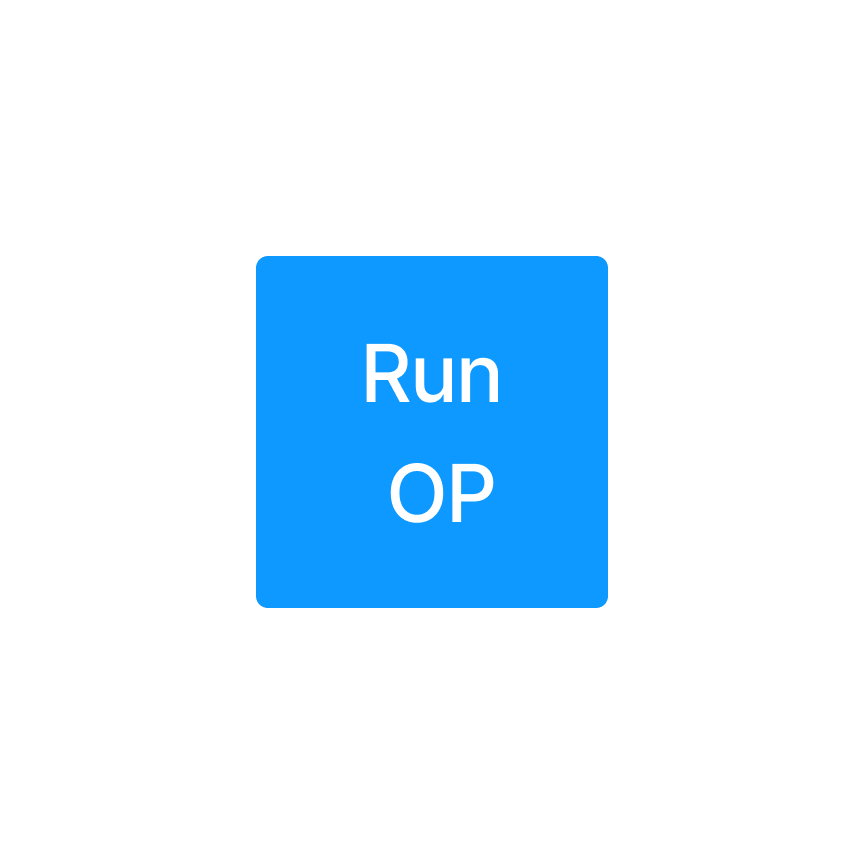
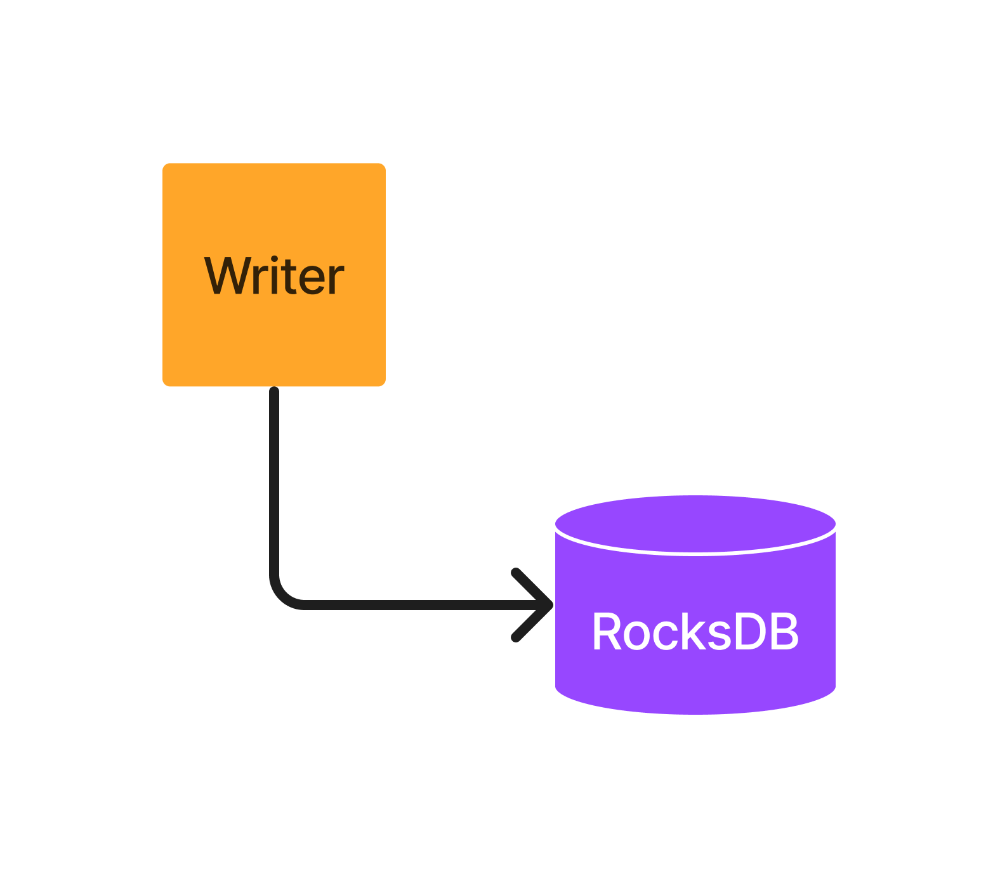
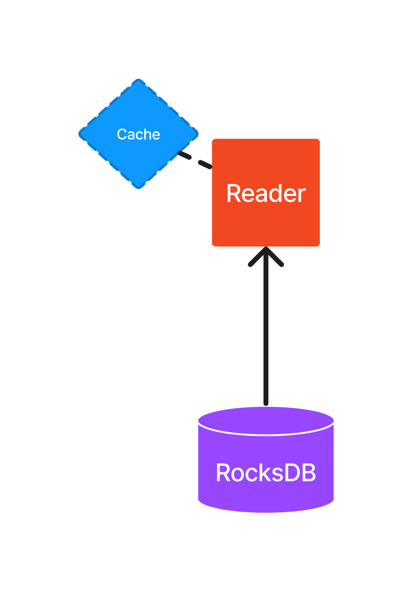
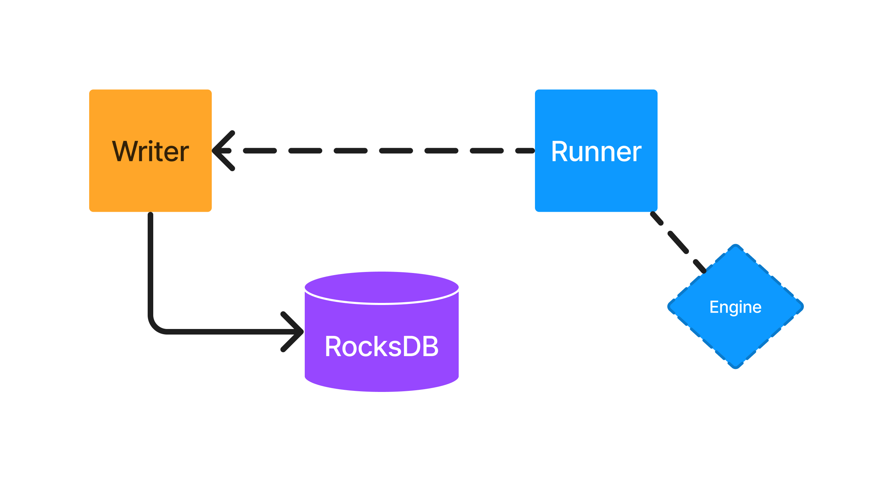

# Wess: WebAssembly Service System

## tl;dr

**Just for Learn!!!**

- Store your WebAsembly
- Run your WebAssembly

## Road Map

| Feature                                                                   | Status | Priority |
| ------------------------------------------------------------------------- | ------ | -------- |
| Docs about how to execute a function                                      | ⏰     | 🔥       |
| Import another wasm module into wasm functions                            | ⏰     | 😴       |
| Give access to `syscall` into wasm functions                              | ⏰     | 😴       |
| Make wasm functions with persisted memory state (store/retrieve)          | ⏰     | 😴       |
| Run Wasm functions multiple params (Array<T>) -> (Array<T>)               | ⏰     | 😴       |
| CRUD ops Wasm module                                                      | ✅     | ✅       |
| Run Wasm functions without params () -> i32                               | ✅     | ✅       |
| Run Wasm functions with one params (i32) -> i32                           | ✅     | ✅       |
| Run Wasm functions multiple params (i32) -> i32                           | ✅     | ✅       |
| Run Wasm functions multiple params (i32/i64/f32/f64) -> (i32/i64/f32/f64) | ✅     | ✅       |
| Logging module                                                            | ✅     | ✅       |
| Read/Write ops on RocksDB                                                 | ✅     | ✅       |
| Export metrics with Prometheu                                             | ✅     | ✅       |
| Reading metrics with Grafana                                              | ✅     | ✅       |
| Load tests with k6                                                        | ✅     | ✅       |
| Behave tests with Behave                                                  | ✅     | ✅       |
| Wasm Exemples                                                             | ✅     | ✅       |

## Architecture



### Request Handles

#### Server

<details>
<summary>
Details
</summary>

- Provide tcp/ip connection to internet, routes to receive and response data


</details>

#### Read Ops

<details>
<summary>
Details
</summary>


1. receive a `id`
2. validate it
3. and ask to [Reader]() about the wasm module
4. respond 200 | 400 | 404 | 500

```
GET /:id
body: {}
```

</details>

#### Write Ops

<details>
<summary>
Details
</summary>


1. receive a json
2. validate it
3. create a new uuid
4. respond 202 | 400 | 404 | 500
5. **[Async after return]** send the json to [Writer]()
6. **[Async after return]** Writer perform op (Create | Update | delete)

```
DELETE /:id
```

```
POST | PUT /

body
{
    wasm: Array<u8> [<1mb]
    metadata: {
        funcitonName: string [<16bytes]
        returnType: Array<string> [<16] ["I32", "I64", "F32", "F64"]
        args: Array<string> [<16] ["I32", "I64", "F32", "F64"]
    }
}
```

Example

```json
{
  "wasm": [ 0, 97, 115, 109, ...],
  "metadata": {
    "functionName": "answer",
    "returnType": [
      "I32"
    ],
    "args": []
  }
}
```

</details>

#### Run Ops

<details>
<summary>
Details
</summary>


1. receive a json
2. validate it
3. send to Reader validate `id`
4. send to Runner execute wasm function
5. respond 201 | 400 | 404 | 500

```
POST /:id

body
[
    params1, params2, ...
]
```

Example

```json
[12, 43]
```

</details>

### Channels

<details>
<summary>
Details
</summary>


- Encapsulates validated data (like a DTO) sends it in a queue to the Worker responsible for the process
- The messages sent are called `Job`s:

```rust
pub enum WriteOps {
    Create,
    Update,
    Delete,
}
pub struct WriteJob {
    pub write_req: Option<WasmModule>,
    pub write_type: WriteOps,
    pub id: String,
}
```

```rust
#[derive(Debug)]
pub struct ReadJob {
    pub responder: Sender<ReadResponse>,
    pub id: String,
}
```

```rust
#[derive(Debug)]
pub struct RunJob {
    pub responder: Sender<RunResponse>,
    pub args: Vec<Value>,
    pub id: String,
}
```

</details>

### Workers

#### Writer

<details>
<summary>
Details
</summary>



- Don't respond anything, just write

1. Receive a `WriteJob` by channel
2. Performs op into database (Rocksdb)

</details>

#### Reader

<details>
<summary>
Details
</summary>



- Just read and respond

1. Receive a `ReadJob` by channel
2. Try found `id` in `Cache`
3. Try found `id` in database (Rocksdb)
4. Send `WasmModule` by channel

</details>

#### Runner

<details>
<summary>
Details
</summary>



- Execute function and return the result

1. Receive a `RunJob` by channel
2. Build `Engine` to try exec function
3. Send result by channel to `RunOps`
4. Send result by channel to `Writter` (statefull call) [Not implemented]

</details>
