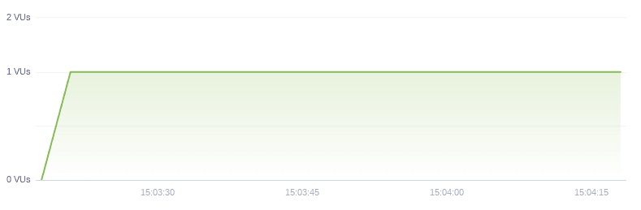
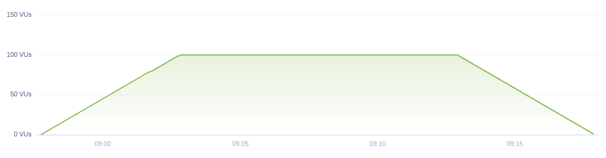
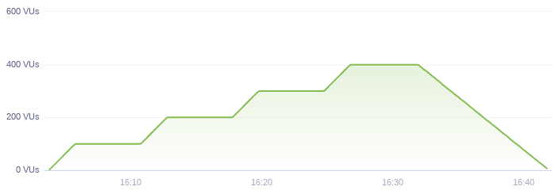
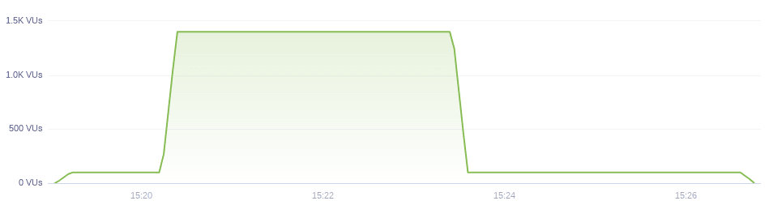
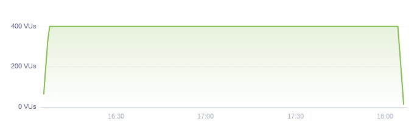

# Performance tests

## Smoke Testing

_Warmup for application and testing_

- Low number of users
- Long enough to go through the whole scenario a few times;
- Will allow you to validate both the test script and the stability of the application before **load test**;
- Executed on every change in the script or application;

## Load Testing

_Checks the behavior of an application under many simultaneous accesses._

- Constantly increases the load of users, respecting the limit of application
- Allows the comparison of response times between different load stages;
- Allows the identification behavior and bottlenecks of the without causing downtime;

## Stress Testing

_Verifies the stability and reliability of an application._

- Constantly increases the load at regular intervals;
- Exceeds the common expectation or metric of application consumption after some time;

## Peak Testing

_Checks the behavior and recovery of the application to a common load exceedance._

- Instantly exceeds the common expectation or metric of application consumption;

### The results can be classified as

1. Excellent: System performance is not impaired during peak traffic. Response time is similar during low traffic and high traffic.
2. Good: Response time is slower, but the system does not produce errors. All requests are answered.
3. Bad: The system produces errors during peak traffic, but returns to normal after traffic slows down.
4. Poor: The system crashes and does not recover after traffic
   traffic slows down.

## Soak Testing

_Checks the behavior of an application during a excess load for a long time_

;

- Verifies that the application does not suffer from bugs or memory leaks, which result in crashes or reboots after several hours of operation.
- It ensures that in case of application restarts, requests are not impacted;
- Makes sure that the database does not exceed out the allocated storage volume and crash.
- Make sure that your logs do not exceed of allocated disk storage.
- Make sure that the external services that you depend on do not stop running after a certain amount of requests amount of requests.
